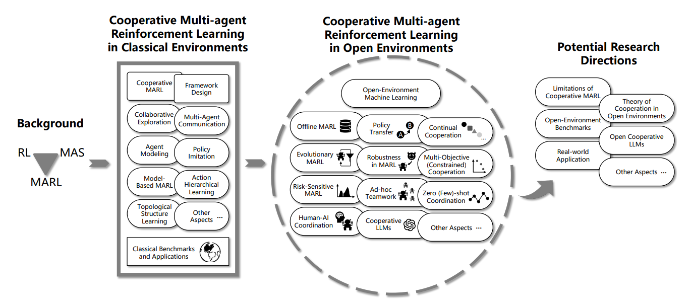
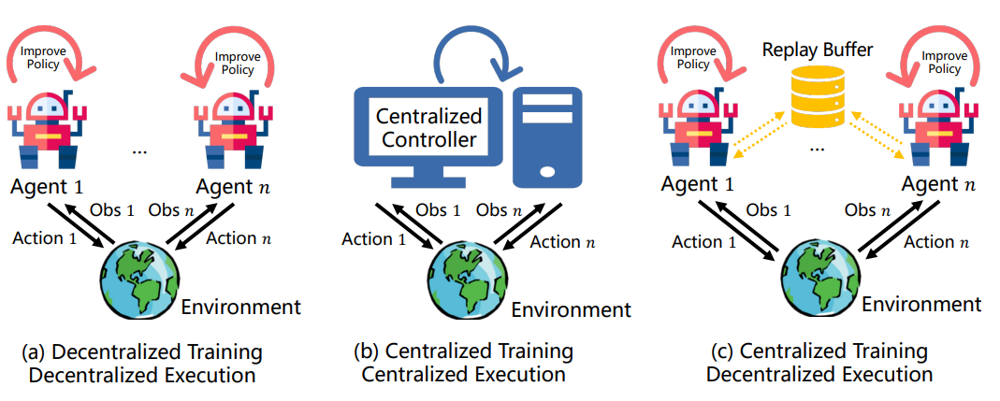
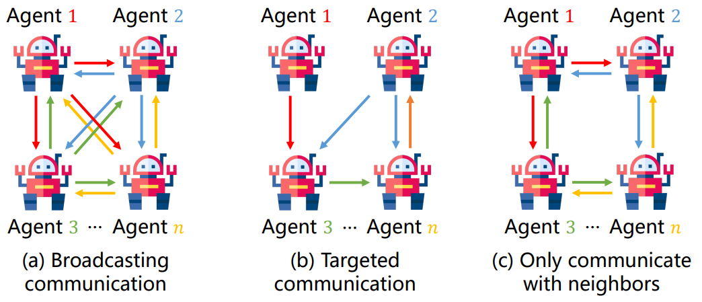
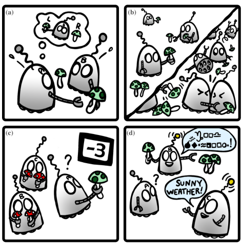
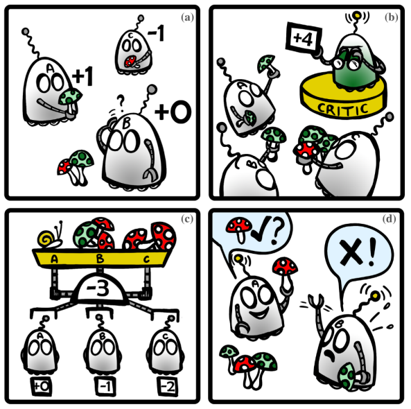
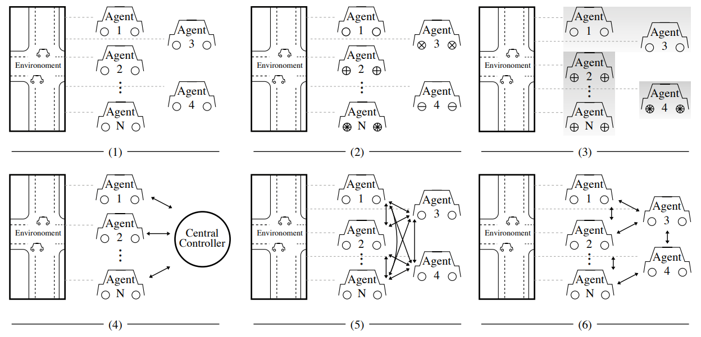

# RL-Swarm-Papers

1. Monitoring cross-research on RL & multi agent robotics.
2. Feel free to open PRs if you want to share the good papers you’ve read.

***

## Table of Content

***

# Research Review

[Sort by time]

***

### Multi-agent Reinforcement Learning: A Comprehensive Survey 

- Paper Link: [arXiv 2312.10256](https://arxiv.org/abs/2312.10256)

***

### A Survey of Progress on Cooperative Multi-agent Reinforcement Learning in Open Environment

- Paper Link: [arXiv 2312.01058](https://arxiv.org/abs/2312.01058)
- Framework Overview:

​	In MARL, training is the process of optimizing policies based on acquired experience (states, actions, rewards, etc.), while execution involves agents interacting with the environment by executing actions according to individual or joint policies. Generally, depending on whether agents need information from other agents during policy updates, the training process can be categorized into Centralized Training and Decentralized Training. Correspondingly, based on whether external information is required during the execution phase, it is categorized into Centralized Execution and Decentralized Execution. Combining these phases, MARL encompasses three paradigms: Decentralized Training Decentralized Execution (DTDE), Centralized Training Centralized Execution (CTCE), and Centralized Training Decentralized Execution (CTDE)

​	Key questions in communication involve determining who to communicate with, what information to communicate, and when to communicate. Current research explores three communication topologies: broadcasting information to all agents, forming network structures for selective communication, or communicating with a subset of neighbors. Policies for handling these questions include direct exchange of local information, preprocessing information before transmission, and optimizing communication timing. In conclusion, the challenges of non-stationarity, scalability, and partial observability in MARL demand innovative solutions to ensure effective learning and decision-making in complex, real-world scenarios.

***

### Multi-Agent Deep Reinforcement Learning for Multi-Robot Applications: A Survey

- Paper Link: [Sensor 2023.03](https://www.mdpi.com/1424-8220/23/7/3625)

***

### Distributed Reinforcement Learning for Robot Teams: A Review

- Paper Link: [arXiv 2204.03516](https://arxiv.org/abs/2204.03516)
- Framework Overview:

​	Key challenges in MARL: 
​	(a) Non-Stationarity - Agents learn in an ever-changing environment, where other agents also constantly update their behavior. As a result, predictions based on past experiences may not be accurate anymore. Here, agent A (wrongly) predicts that agent B will go for the left mushroom. 
​	(b) Scalability - Agents trained in a smaller team may struggle at generalizing their strategy to a larger one. 
​	(c) Partial Observability - Agents may be confused by shared rewards, which often depend on the action of agents beyond their sensing range. 
​	(d) Communication - Agents need to identify and encode relevant information in a commonly agreed upon manner, and must often learn to select whom to speak/listen to, to avoid being overwhelmed. Here, agent A cannot understand the useful message from agent B, deciding instead to listen to the useless, yet understandable message from agent C. 

Cooperation approaches in MARL. 
	(a) Independent Learning - Agents learn policies (here, from individual rewards) by treating other agents as part of their common environment. 
	(b) During training, a Centralized Critic can provide a more accurate cooperative baseline - the state value, i.e., the expected long-term return from the current state, by relying on augmented state and policy information from all agents. Learned policies remain decentralized. 
	(c) Factorized Value Functions - Agents learn to explicitly address the credit assignment problem to transform a shared reward into individual contributions that can be used to update their individual policy 
	(d) Communication Learning - Agents learn to identify, encode, and share relevant information to augment each other’s knowledge about the system.

- Review: 
    This work focuses on robot teams in both fully cooperative and mixed cooperative-competitive settings.

***

### Model-based Multi-agent Reinforcement Learning: Recent Progress and Prospects

- Paper Link: [arXiv 2203.10603](https://arxiv.org/abs/2203.10603)

***

### An Overview of Multi-Agent Reinforcement Learning from Game Theoretical Perspective

- Paper Link: [arXiv 2011.00583](https://arxiv.org/abs/2011.00583)
- Framework Overview: 

 

Common learning paradigms of MARL algorithms.
(1) Independent learners with shared policy. 
(2) Independent learners with independent policies (i.e. , denoted by the difference in wheels). 
(3) Independent learners with shared policy within a group. 
(4) One central controller controls all agents: agents can exchange information with any other agents at any time. 
(5) Centralised training with decentralised execution (CTDE): only during training, agents can exchange information with others; during execution, they act independently. 
(6) Decentralised training with networked agents: during training, agents can exchange information with their neighbours in the network; during execution, they act independently.

***

### Multi-Agent Reinforcement Learning: A Selective Overview of Theories and Algorithms

- Paper Link: [arXiv 1911.10635](https://arxiv.org/abs/1911.10635) 

***

### A comprehensive survey of multi-agent reinforcement learning

- Paper Link: [IEEE 2007.913919](https://ieeexplore.ieee.org/abstract/document/4445757/)

***

### 智能集群系统的强化学习方法综述

- Paper Link: [中国计算机学报CJC 2023.12](http://cjc.ict.ac.cn/online/onlinepaper/lll-20231210115504.pdf)

***

### 多智能体深度强化学习的若干关键科学问题

- Paper Link: [中国自动化学报ACTA 2020.7](http://www.aas.net.cn/fileZDHXB/journal/article/zdhxb/2020/7/PDF/AAS-CN-2020-0159.pdf)

***

### 万字长文：详解多智能体强化学习的基础和应用

- Web Link: [机器之心 2020.11](https://zhuanlan.zhihu.com/p/272735656)

***

Chinese Web

- Multi-agent pathfinding 传统方法和强化学习结合的多智能体路径规划 [Zhihu 2020.12](https://zhuanlan.zhihu.com/p/337729123)
- 

## Papers

[sort by time]

***

### Deep Reinforcement Learning-based Large-scale Robot Exploration

- Paper Link: [arXiv 2403](https://arxiv.org/html/2403.10833v1), [Homepage](https://github.com/marmotlab/large-scale-DRL-exploration)

***

### Efficient Multi-agent Reinforcement Learning by Planning

- Paper Link: [ICLR 2024.01](https://openreview.net/forum?id=CpnKq3UJwp)

***

### Predator–prey survival pressure is sufficient to evolve swarming behaviors

- Paper Link: [New Journal of Physics 2023.08](https://iopscience.iop.org/article/10.1088/1367-2630/acf33a/pdf)

***

### Safe Interval Path Planning With Kinodynamic Constraints

- Paper Link: [arXiv 2023.02](https://arxiv.org/abs/2302.00776v1)

***

### PRIMAL: Pathfinding via Reinforcement and Imitation Multi-Agent Learning

- Paper Link: [IEEE 2019](https://ieeexplore.ieee.org/stamp/stamp.jsp?tp=&arnumber=8661608)

***

### SIPP: Safe Interval Path Planning for Dynamic Environments

- Paper Link: [IEEE 2011](https://ieeexplore.ieee.org/document/5980306)

***

### Conflict-based search for optimal multi-agent pathfinding

- Paper Link: [Elsevier 2014.11](https://www.sciencedirect.com/science/article/pii/S0004370214001386)

***

# Github Responsity:

- Multi Agent Reinforcement Learning papers(latest commit 2022.09): https://github.com/TimeBreaker/Multi-Agent-Reinforcement-Learning-papers 
- MARL papers with code(latest commit 2022.09): https://github.com/TimeBreaker/MARL-papers-with-code

- MARL resources collection(latest commit 2022.10): https://github.com/TimeBreaker/MARL-resources-collection

***

### Open Source Env

- Multi-Agent path planning in Python: [Github Link](https://github.com/atb033/multi_agent_path_planning?tab=readme-ov-file)

- 
